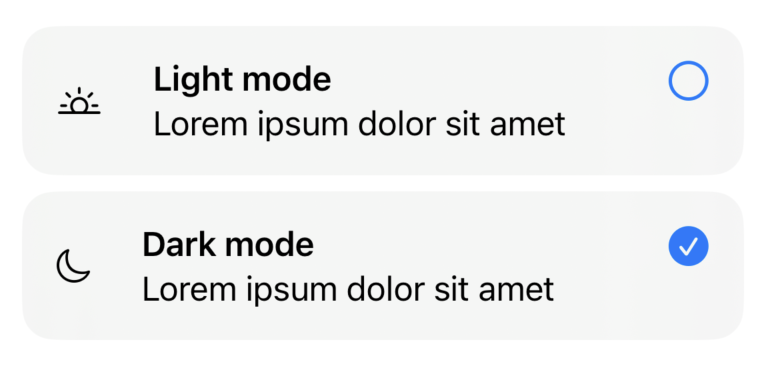

# SwiftUICardPicker

This library implements a picker component consisting of cards, inspired by StoreKit's [SubscriptionStoreView](https://developer.apple.com/documentation/storekit/subscriptionstoreview).



## Usage:

```swift
import SwiftUI
import SwiftUICardPicker

struct MyView: View {
    @State var selection: Option? = lightModeOption

    var body: some View {
        CardPicker(selection: $selection) {
            ForEach(options, id: \.self) { option in
                // Render card contents here
            }
        }
    }
}

```

### Contributions are welcome!
